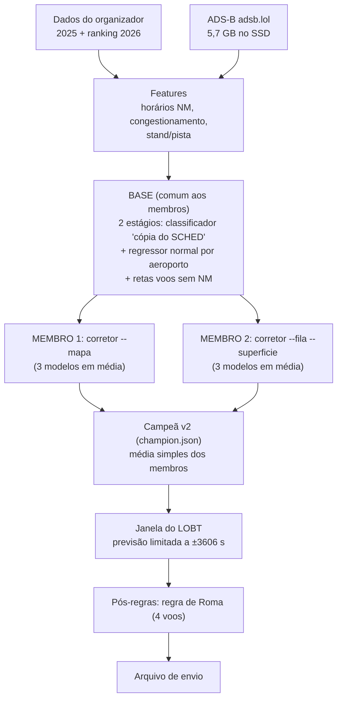
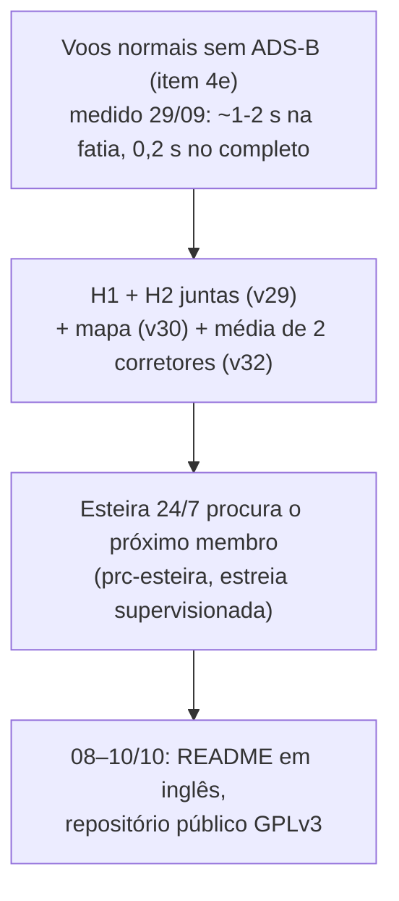

# Mapa do projeto (atualizado em 30/09, 04h UTC)

Resumo para se localizar. Detalhes: `README.md` (modelo, roadmap, envios) e `CONTEXTO.md` (linha do tempo).

## Objetivo: top 3 (decisão do usuário, 28/09)

Entramos para ganhar. O top 3 não vem de melhorar os voos normais: pela conta da v11,
a cauda (voos de horas, off-block gravado como horário programado ou padrão, aeroportos sem
ADS-B) é ~60 % do erro², e mesmo zerando o erro dos normais não chegaríamos a 228. O topo
erra menos na cauda.

Princípios:

1. **Se um competidor achou, a gente acha.** Buscar ativamente dados abertos que expliquem a
   cauda e cubram os aeroportos sem ADS-B (LTFM, LFPG, EGLL), e regras exatas no próprio dado
   (como a janela do LOBT). Ideias de repositórios públicos valem; código deles, não (regra de
   originalidade).
2. **Busca automática em massa onde ela ajuda:** centenas de combinações do corretor barato
   (~1 min cada) rodando à noite, com a simulação decidindo. Tuning sozinho não ganhou para
   ninguém (Discord); a busca serve para combinar features e fontes novas.
3. **Decidir pela simulação**, enviar só o que melhora, e guardar os 5 envios diários para
   confirmar.

Estudo da cauda (28/09, `docs/research/2026-09-28-estudo-cauda.md`): loterias são um piso comum
a todos os times; a distância para o topo está na parte previsível (normais e cópias).

Frentes abertas (30/09): esteira 24/7 varrendo o corretor; fonte de dado nova que cubra os
aeroportos sem ADS-B (OPDI e meteorologia já dentro; OpenSky/Trino proibido); a cauda e as loterias.

## Onde estamos

| Item | Situação |
|---|---|
| Nota oficial | **247,11 s** (v32, 30/09 02h23 UTC) |
| Posição | 22º de 159 |
| 1º colocado | 220,40 (faltam 26,7 s) |
| 3º colocado | 224,50 (faltam 22,6 s) |
| 10º colocado | 236,71 (faltam 10,4 s) |
| Prazo | 11/10, 23:59 (horário da Europa) |
| Envios | 5 por dia UTC (zera às 21h de Brasília) |
| Repositório | privado; abrir entre 08 e 10/10 (condição do prêmio) |

## O caminho até aqui

```mermaid
flowchart LR
    A["v1 514<br/>modelo básico"] --> B["v2 385<br/>outliers no treino"]
    B --> C["v3 339<br/>2 estágios"]
    C --> D["v5 331<br/>retas voos sem NM"]
    D --> E["v6 315<br/>ADS-B adsb.lol"]
    E --> F["v9 276<br/>janela do LOBT<br/>+ corretor"]
    F --> G["v11 267<br/>taxi-in chegadas<br/>+ vizinhos"]
    G --> H["v12 265<br/>3 corretores"]
    H --> I["v13 264,35<br/>regra de Roma"]
    I --> J2["v17 256,86<br/>regressor limpo +<br/>companhia, séries diárias, OPDI"]
    J2 --> K["v19 253,95<br/>METAR, rotação no stand,<br/>consistência NM, companhia"]
    K --> L["v21 252,34<br/>base com contexto (ctx_*)"]
    L --> M["v27 251,10<br/>distância aos horários planejados"]
    M --> N["v28 249,16<br/>pátio do stand + 500 rodadas"]
    N --> O["v29 247,83<br/>regressor por aeroporto<br/>+ célula stand × pista"]
    O --> P["v30 247,76<br/>mapa do aeroporto"]
    P --> Q["v32 247,11<br/>média de 2 corretores<br/>sobre a mesma base"]
```

## Como o modelo funciona

A campeã é um conjunto: `champion.json` guarda a `base` comum, a lista de `membros`
(um corretor cada, com a config completa) e as `pos_regras`. `src/campeao.py` monta a
previsão média; `src/train.py submit N` refaz tudo no ano inteiro. A esteira
(`src/esteira.py` + `src/regua.py`) propõe trocar um membro, somar um novo ou substituir
o conjunto, e só aprova com confirmação cega na metade B dos dias.

## Onde está o erro (simulação da v11)

| Parte | % do erro² | Dá para melhorar? |
|---|---|---|
| "Loterias": 11 voos de horas sem explicação | ~34 % | quase impossível |
| Voos normais sem ADS-B (LTFM, LFPG, LEMD…) | ~31 % | sim, pela base |
| Cauda que é cópia de horário | ~13 % | pouco |
| Voos normais com ADS-B | ~11 % | pouco |
| Alarmes falsos (normal previsto > 1 h) | ~11 % | um pouco |

## Descartados

Seeds, detector de pushback, fila vista pelo ADS-B, CatBoost sozinho, média mensal oficial,
tirar lat/lon do ADS-B, alvo residual, calibração de p, mistura multiclasse.

## Para onde vamos (a partir de 30/09)

Feito em 28–30/09: v19 253,95 → v21 252,34 → v27 251,10 → v28 249,16 → v29 247,83 → v30 247,76 →
**v32 247,11** (média de dois corretores sobre a mesma base). A retrospectiva de 29/09
(`docs/research/2026-09-29-retrospectiva.md`) fechou a busca dentro das colunas que temos: janelas por
grupo, deslocamentos exatos e o detetive do resíduo não acham nada (o detetive otimista com todas as
colunas *piora*: 233,31 → 234,07 sem loteria). **Ganho novo exige informação nova ou a cauda.**

Três frentes:

1. **Esteira de experimentos no ar** (`src/esteira.py` + `src/regua.py`, serviço `prc-esteira` desde
   30/09 ~00h57 -03, estreia supervisionada): a fila roda os candidatos baratos do corretor sozinha,
   com seleção na metade A e confirmação cega na B. Dever do agente: auditar os 10 primeiros
   vereditos e calibrar a régua (hoje `GANHO_A = 0,3` com IC baixo > 0 reprovou a própria campeã),
   registrando em `docs/esteira.md` ("Revisões"). Relatório e comandos: README, "Esteira de experimentos".
2. **Informação nova de fora** (LTFM sem ADS-B nem em 2026; Trino do OpenSky proibido, Discord 29/09).
3. **Loterias** (38 % do erro²) e os itens "grandes" da retrospectiva (folha `dist_lo ≤ 0`,
   registro × sensor, loterias do LFPG sem NM).

Descartados contra a campeã: base com plano 13, `--fila` completo, base com mais rodadas, hedge de
Roma, cobertura ADS-B 2026, tirar ctx do corretor, pesos, p(cópia), só LGB/só CatBoost, XGBoost na base
e como 4º corretor, LightGBM na GPU, superfície sozinha (ATD2), **mapa do aeroporto na base**
(o `--mapa` no corretor entrou na v30), **caçador de regras 2** (sequência de pousos no stand, mesmo
voo em outro mês; `docs/research/2026-09-29-cacador-de-regras-2.md`), **próximo ocupante do stand pelo
`icao24`** (retrospectiva: o oráculo de −10 s vinha de casamentos errados), **simulação repesada para a
mistura de 2026** (não explica o oficial melhor que `sem_loteria`).

### Item 4e: voos normais sem ADS-B (29/09)

Diagnóstico sobre o oof da v28: nenhum agrupamento novo sobrou (stand, companhia, tipo, destino:
R² leave-one-out ≈ 0), fila de pushback pelo AOBT_3 e configuração de pista não correlacionam com o
resíduo (|r| ≤ 0,03), o OPDI não vê o solo nesses aeroportos (casa 0–3 % dos voos) e a previsão já está
calibrada (inclinação 0,97–1,03). Sobra um estado de aeroporto por bloco de 30 min (desvio 58–92 s,
vale −3 a −14 s por aeroporto) que **não é observável** no ranking.

| | completo | normais NM | os 4 sem ADS-B |
|---|---|---|---|
| v28 | 299,41 | 193,45 | 212,92 |
| `--corretor-ref` (célula aeroporto × stand × pista) | 299,23 | 192,85 | 212,08 |
| `--base-por-apt` (regressor por aeroporto na base) | 299,23 | 191,90 | 211,78 |

A base com regressor por aeroporto sozinha é o maior ganho de base desde `--base-ctx`
(311,18 → 308,75, +2,4 s, IC +1,8 a +3,3, passa o portão); o corretor da v28 absorve quase tudo.
Nenhuma passa o portão no `completo` (IC baixo < −0,5, sem top 10 < 0, julho < 0).

| Etapa | Ganho esperado (oficial) | Quando |
|---|---|---|
| Base mais forte sem ADS-B | medido: 0,2 s no completo, 1,5 s nos normais | feito 29/09 |
| H1 + H2 juntas (v29) | simulação 299,10 (+0,3 s, IC −0,7 a 1,3; sem loteria +1,2, IC 0,7 a 1,8); **oficial 247,83 (−1,33 s)** | enviada 29/09 |
| v29 + `--mapa` no corretor (v30, `20260929-154118-v29_mapa_cf`) | simulação 298,05 (+1,1 s, IC 0,5 a 1,7; sem top 10 +0,5; jan +0,6, jul +1,5; sem loteria +0,7, IC 0,1 a 1,3); **oficial 247,76 (−0,07 s)** | enviada 29/09 |
| v32 = v30 + membro `--fila --superficie` (`20260929-220513-e2_fila_sup`) | simulação: sem loteria +0,95 (IC baixo +0,21), completo +0,38; **oficial 247,11 (−0,65 s)** | enviada 30/09 |
| Próximo membro pela esteira | a decidir pela régua (A seleciona, B confirma) | em curso |
| Meta | top 10 (~237); top 3 pede ~220 | até 11/10 |

Lições de 28/09: a simulação acerta o oficial (−2,8→−2,91; −2,1→−1,61; −1,1→−1,24); o corretor
barato de 1 LightGBM não prevê o corretor real (usar `--reusar-oof` / laço fiel); GPU não é a
alavanca (limite é informação, não cálculo).

Lição de 29/09 (v29): com o `completo` preso no ruído das loterias, o ganho `sem_loteria` com IC
todo positivo previu o oficial melhor que o portão (+1,2 s simulado sem loteria → −1,33 s oficial).

## Regras

- Medir tudo na simulação (jan+jul/2025) e enviar só o que melhora; nada de envio para sondar.
- Todo envio com ok do usuário.
- Treinos longos como serviço do sistema; estado no git, nos `.md` e na memória.
