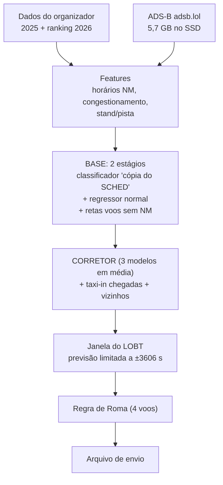
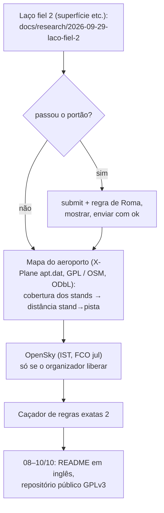

# Mapa do projeto (atualizado em 29/09, 02h UTC)

Resumo para se localizar. Detalhes: `README.md` (modelo, roadmap, envios) e `CONTEXTO.md` (linha do tempo).

## Objetivo: top 3 (decisão do usuário, 28/09)

Entramos para ganhar. O top 3 não vem de melhorar os voos normais: pela conta da v11,
a cauda (voos de horas, off-block gravado como horário programado ou padrão, aeroportos sem
ADS-B) é ~60 % do erro², e mesmo zerando o erro dos normais não chegaríamos a 228. O topo
erra menos na cauda.

Princípios:

1. **Se um competidor achou, a gente acha.** Buscar ativamente dados abertos que expliquem a
   cauda e cubram os aeroportos sem ADS-B (LTFM, LFPG, EGLL), e regras exatas no próprio dado
   (como a janela do LOBT). Ideias de repositórios públicos valem; código deles, não (regra de
   originalidade).
2. **Busca automática em massa onde ela ajuda:** centenas de combinações do corretor barato
   (~1 min cada) rodando à noite, com a simulação decidindo. Tuning sozinho não ganhou para
   ninguém (Discord); a busca serve para combinar features e fontes novas.
3. **Decidir pela simulação**, enviar só o que melhora, e guardar os 5 envios diários para
   confirmar.

Estudo da cauda (28/09, `docs/research/2026-09-28-estudo-cauda.md`): loterias são um piso comum
a todos os times; a distância para o topo está na parte previsível (normais e cópias).

Frentes abertas: fontes de dados (OPDI, OpenSky, regulações ATFM, meteorologia, layout de
aeroporto); estudo da cauda; plano 11 (regressor limpo).

## Onde estamos

| Item | Situação |
|---|---|
| Nota oficial | **251,10 s** (v27) |
| Posição | 25º de ~167 |
| 3º colocado | 224,50 (faltam 26,6 s) |
| 10º colocado | 236,98 (faltam 14,1 s) |
| Prazo | 11/10, 23:59 (horário da Europa) |
| Envios | 5 por dia UTC (zera às 21h de Brasília) |
| Repositório | privado; abrir entre 08 e 10/10 (condição do prêmio) |

## O caminho até aqui

```mermaid
flowchart LR
    A["v1 514<br/>modelo básico"] --> B["v2 385<br/>outliers no treino"]
    B --> C["v3 339<br/>2 estágios"]
    C --> D["v5 331<br/>retas voos sem NM"]
    D --> E["v6 315<br/>ADS-B adsb.lol"]
    E --> F["v9 276<br/>janela do LOBT<br/>+ corretor"]
    F --> G["v11 267<br/>taxi-in chegadas<br/>+ vizinhos"]
    G --> H["v12 265<br/>3 corretores"]
    H --> I["v13 264,35<br/>regra de Roma"]
    I --> J2["v17 256,86<br/>regressor limpo +<br/>companhia, séries diárias, OPDI"]
    J2 --> K["v19 253,95<br/>METAR, rotação no stand,<br/>consistência NM, companhia"]
    K --> L["v21 252,34<br/>base com contexto (ctx_*)"]
    L --> M["v27 251,10<br/>distância aos horários planejados"]
```

## Como o modelo funciona

## Onde está o erro (simulação da v11)

| Parte | % do erro² | Dá para melhorar? |
|---|---|---|
| "Loterias": 11 voos de horas sem explicação | ~34 % | quase impossível |
| Voos normais sem ADS-B (LTFM, LFPG, LEMD…) | ~31 % | sim, pela base |
| Cauda que é cópia de horário | ~13 % | pouco |
| Voos normais com ADS-B | ~11 % | pouco |
| Alarmes falsos (normal previsto > 1 h) | ~11 % | um pouco |

## Descartados

Seeds, detector de pushback, fila vista pelo ADS-B, CatBoost sozinho, média mensal oficial,
tirar lat/lon do ADS-B, alvo residual, calibração de p, mistura multiclasse.

## Para onde vamos (a partir de 29/09)

Feito em 28/09: v19 253,95 → v21 252,34 → v27 251,10. Descartados contra a campeã: base com plano 13,
`--fila`, base com mais rodadas, hedge de Roma, cobertura ADS-B 2026, tirar ctx do corretor, pátio do stand,
pesos, p(cópia), só LGB/só CatBoost, 500 rodadas, XGBoost na base e como 4º corretor, LightGBM na GPU.

| Etapa | Ganho esperado (oficial) | Quando |
|---|---|---|
| Laço fiel 2 | 0 a −1 s | 29/09 manhã |
| Mapa do aeroporto | incerto; é informação nova que o 3º usa | 29–30/09 |
| OpenSky / regras exatas | incerto | se liberado / 30/09+ |
| Meta | top 10 (~237); top 3 pede ~220 | até 11/10 |

Lições de 28/09: a simulação acerta o oficial (−2,8→−2,91; −2,1→−1,61; −1,1→−1,24); o corretor
barato de 1 LightGBM não prevê o corretor real (usar `--reusar-oof` / laço fiel); GPU não é a
alavanca (limite é informação, não cálculo).

## Regras

- Medir tudo na simulação (jan+jul/2025) e enviar só o que melhora; nada de envio para sondar.
- Todo envio com ok do usuário.
- Treinos longos como serviço do sistema; estado no git, nos `.md` e na memória.
