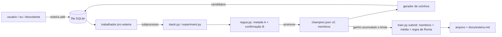

# Esteira de experimentos — PRC 2026 taxi-out

Data: 30/09/2026. Status: abordagem A aprovada em conversa (decisões abaixo); spec aguardando
revisão do usuário. Prazo da competição: 11/10/2026 23:59:59 CET.

## Objetivo

Trocar o ciclo manual (eu disparo, leio log, decido, gero arquivo) por um serviço 24/7 que testa
candidatos em fila, encadeia versão sobre versão sem perder a assertividade da régua atual e
entrega arquivos de envio prontos com relatório. Meta de vazão: ~100 corretores/dia contra ~10
hoje.

Fora de escopo nesta spec: o **motor de descoberta** (caçadores, detetive, revisão de descartes
automáticos) — ele só precisa da interface da fila (`esteira add`), definida aqui, e terá spec
própria. Também fora: envio automático, painel web, bases geradas sem pedido.

## Decisões (conversa de 30/09)

| Tema | Decisão |
|---|---|
| Autonomia | Para no arquivo pronto + relatório; o envio continua com o ok do usuário. |
| Operação | Serviço 24/7 (`prc-esteira`) consumindo uma fila; pausa por comando. |
| Promoção | Simulação com confirmação cega: escolhe numa metade fixa dos dias, promove só se ganhar também na outra. |
| Candidatos gerados sozinha | Variações do corretor e médias de corretores. Bases novas só entram pela fila. |
| Arquitetura | A: fila + trabalhador que chama os comandos existentes como processos separados. |

## Restrições medidas

- RAM 15 GB: um processo pesado de cada vez (envio ~9,5 GB; `stack.py` ~7,8 GB). O `systemd-oomd`
  matou a v32 em 29/09 quando dois rodaram juntos.
- Tempos: corretor com `--reusar-oof` ~10 min; base nova + oof ~50–60 min; arquivo de envio
  ~21 min quando a previsão fora do bloco está no cache (`data/cache/oof_base/`).
- Ruído: o mesmo corretor rodado de novo varia ~0,3 s no completo e ~0,2 s sem loteria
  (CatBoost na GPU não repete o número).
- Régua que previu o oficial nos últimos envios: ganho `sem_loteria` com IC > 0. O `completo`
  sozinho errou a v29 (+0,3 → oficial −1,33) e a v30 (+1,1 → −0,07).

## Arquitetura



### 1. Fila — `src/esteira.py`, `data/esteira.db` (SQLite, fora do git)

Tabela `candidatos`: `id`, `criado`, `origem` (`usuario`, `agente`, `gerador`, `descoberta`),
`tipo` (`corretor`, `base`), `receita` (JSON com as opções do `stack.py`/`experiment.py`),
`prioridade` (int, maior primeiro), `estado` (`fila`, `rodando`, `feito`, `falhou`, `pulado`),
`campea_na_hora` (id da campeã quando entrou), `run_id`, `resultado` (JSON da régua), `motivo`.

Deduplicação: a receita é normalizada (opções ordenadas) e tem hash; receita igual a uma já
feita contra a mesma campeã não entra de novo.

CLI (mesmo arquivo): `esteira add --tipo corretor --receita '<json>' [--prioridade N]
[--origem X]`, `esteira fila`, `esteira pausar`, `esteira retomar`, `esteira status`.
`esteira pausar` grava `data/esteira.pausa`; o trabalhador termina o candidato em curso e para.

### 2. Trabalhador — `esteira trabalhar` (serviço `systemd --user` `prc-esteira`)

Laço: se pausado, dorme; senão pega o candidato de maior prioridade (e mais antigo) em `fila`,
marca `rodando`, executa, avalia, grava, repete. Antes de cada processo pesado confere
`MemAvailable ≥ 8 GB` (era 10; ajustado na estreia de 30/09: com o desktop aberto sobram ~9,3 GB) (lê `/proc/meminfo`); se não houver, espera. Ao reiniciar, candidatos em
`rodando` voltam para `fila` (a execução é idempotente: `stack.py` grava corridas novas).

Execução por tipo, sempre como subprocesso (`bin/run`, que já limita CPU):
- `corretor`: `stack.py e_<id> --base <base da campeã> --crossfit <receita> --reusar-oof <oof da campeã>`.
- `base` (**revisão 30/09**): `experiment.py` com a receita da base e depois a média completa
  refeita sobre ela — um `stack.py e<id>_m<i>` por membro da campeã, na ordem, com a receita
  de corretor daquele membro. O primeiro calcula o oof fora do bloco do zero (~50 min) e os
  seguintes usam `--reusar-oof <id do primeiro>` (~10 min cada): ~1 h no total. `executar`
  devolve a lista de run_ids e a régua compara média nova × média velha
  (`regua.avaliar_conjunto`, proposta única `base_nova`), em vez do corretor sozinho contra a
  média da campeã, que perdia por construção.

Falha do subprocesso: `falhou` com as últimas linhas do log em `motivo`; a esteira segue.

### 3. Régua — `src/regua.py`

Metades fixas dos dias do holdout (jan+jul 2025): dias ordenados, alternados A, B, A, B…
(os dois meses ficam nas duas metades). Gravadas uma vez em `data/esteira_metades.json`.

Para um candidato, a esteira calcula a previsão da **campeã** (média dos membros) e três
propostas: (i) **troca** — o candidato no lugar de um membro, para cada membro; (ii) **soma** —
o candidato como membro novo (média simples); (iii) **sozinho**. Cada proposta é comparada à
campeã com o bootstrap pareado por dia do `compare.py`.

- **Seleção (metade A):** ganho `sem_loteria` ≥ 0,3 s e IC baixo > 0. Entre as propostas que
  passam, fica a de maior ganho.
- **Confirmação cega (metade B):** a proposta escolhida precisa de ganho `sem_loteria` > 0 com IC
  baixo > −0,3, e o `completo` nos dias todos ≥ −0,5 s.
- Aprovado nas duas → promove. Reprovado em B → `pulado` com o motivo; B nunca é usada para
  escolher.

Contador de consultas a B em `docs/esteira.md`: B também se desgasta com uso repetido; o envio
oficial é a checagem final.

### 4. Campeã v2 — `champion.json`

Passa a descrever a média de corretores sobre uma base:

```json
{"base": "<id base>", "oof": "<id da corrida com o oof>",
 "membros": [{"id": "<run>", "config": {...}}, ...],
 "pos_regras": ["roma"], "src_hash": "...", "git_commit": "..."}
```

Migração: a v32 atual vira `membros = [v29_mapa_cf, e2_fila_sup]`. `compare.py`, `train.py` e a
auditoria passam a ler esse formato (corte limpo, sem ler o antigo).

### 5. Arquivo de envio — `train.py submit N`

Lê `champion.json` v2: gera a previsão de cada membro (corretor treinado nas cegas com o oof do
cache + base final uma vez só), faz a média e aplica as pós-regras. A regra de Roma sai do arquivo
colado à mão e vira código em `src/pos_regras.py` (`54310,76 + 0,38·(MVT − SCHED)` em LIRF sem NM
com MVT − SCHED em (15 h, 30 h]; conferida contra os 4 valores da v28–v32). Sem cache por
membro: dois membros custam ~30 min (base final uma vez, um corretor por membro).

A esteira dispara `train.py submit` quando o ganho `sem_loteria` acumulado sobre a última campeã
enviada passa de 0,5 s, no máximo uma vez a cada 6 h, e só se não houver arquivo pronto esperando
ok. Resultado: `submissions/<TEAM>_vN.parquet` + seção "Pronto para enviar" no relatório.

### 6. Gerador de vizinhos — `esteira gerar`

Chamado quando a fila de `gerador` fica vazia. Espaço (só corretor):
- blocos liga/desliga: `--stand-prefixo`|`--fila`, `--superficie`, `--mapa`, `--corretor-ref`,
  `--dist-plano`, `--corretor-sem-ctx`;
- parâmetros do LightGBM do corretor (opção `--corretor-params '<json>'`): `num_leaves`
  63/127/255 e `learning_rate` 0,03/0,05.

**Revisão 30/09**: dos 53 testes da estreia (madrugada de 30/09) os parâmetros deram média
−0,10 s e as rodadas −0,11 s (6 testes), com uma única promoção — `num_leaves` 127. As
rodadas saíram da grade (`ROUNDS = ()`) junto com `lambda_l2` e `min_data_in_leaf`.

Vizinhos = mudar **uma** coisa em relação a cada membro da campeã. Receitas já feitas contra a
campeã atual são puladas (hash). Prioridade: vizinhos de membro recém-promovido primeiro.

### 7. Relatório — `docs/esteira.md` (regravado a cada candidato)

Campeã atual (membros, simulação completa/sem loteria), ganho acumulado desde o último envio,
arquivo pronto (se houver), últimos 30 candidatos (receita, A, B, decisão, minutos), tamanho da
fila, consultas a B, candidatos por hora nas últimas 24 h. Commit automático do relatório e da
`champion.json` a cada promoção (mensagem `esteira: promove <id>`), sem push.

## Supervisão: a esteira também é auditada (pedido do usuário, 30/09)

A esteira é nova e fica sempre sujeita a melhoria. Quem audita é o agente (eu), em duas fases:

1. **Estreia supervisionada:** os primeiros 10 candidatos e as primeiras 24 h são acompanhados de
   perto: cada decisão da régua é conferida contra o `compare.py` manual, cada falha é lida, e o
   tempo por candidato é comparado ao medido à mão (~10 min). Só depois disso a esteira roda
   sozinha à noite.
2. **Revisão periódica:** uma vez por dia (junto da auditoria diária, `ferramentas/auditoria.py`)
   e a cada envio oficial, uma seção "Esteira" no relatório da auditoria com números que dizem se
   o automatizador está bom:
   - vazão: candidatos por hora, minutos por candidato, tempo parado (pausa, espera de RAM, falha);
   - desperdício: falhas, duplicados pulados, candidatos que não mudaram a previsão;
   - rendimento do gerador: fração de candidatos promovidos por tipo de vizinho (blocos, rodadas,
     parâmetros), para cortar o que nunca rende;
   - calibração da régua: para cada envio, ganho previsto (A, B, sem loteria) × ganho oficial; se
     a régua errar o sinal em 2 envios seguidos, os limiares são revistos;
   - desgaste de B: consultas acumuladas; acima de 50, as metades são sorteadas de novo e o fato é
     registrado.

Cada revisão termina em uma de três saídas, registrada em `docs/esteira.md` ("Revisões"):
nada a mudar; ajuste de parâmetro da própria esteira (limiar, prioridade, espaço do gerador);
ou mudança de código (nova spec curta ou item no plano). A revisão é ponto fixo do bloco
"Retomar" do `CONTEXTO.md`, para que um chat novo também a faça.

## Erros e bordas

- PC cai: o serviço volta (`Restart=on-failure`); `rodando` → `fila`.
- Código muda no meio (eu edito `src/`): candidatos já medidos seguem válidos contra a campeã do
  momento; `src_hash` vai no registro de cada corrida. `train.py submit` deixa de abortar por
  `src_hash` diferente (a trava pedia `--forcar` a cada edição e travaria a esteira); a prova de
  reprodutibilidade é refazer a v32 (seção Testes).
- Candidato de base (base nova) só entra **sozinho**: a média exige membros da mesma base.
- Oof da campeã ausente do cache: a esteira recalcula (~50 min) uma vez.
- XGBoost com categoria nova no holdout: continua fora do espaço do gerador.

## Testes (permanentes)

- `regua.py`: metades determinísticas e disjuntas; seleção só em A; confirmação reprova quem só
  ganha em A; propostas troca/soma/sozinho com previsões sintéticas.
- `esteira.py`: deduplicação por hash; ordem por prioridade; pausa; `rodando` volta à fila no
  reinício; espera de RAM.
- `pos_regras.py`: reproduz os 4 valores da regra de Roma da v28–v32 nos voos do ranking.
- `train.py`: média de membros e pós-regras com modelos falsos.

Verificação ponta a ponta: com a campeã v32 migrada, `train.py submit` refaz a v32 e bate com
`submissions/outgoing-boat_v32.parquet` (diferença só do ruído do CatBoost, ~20 s rms; os 4 voos
de Roma idênticos); a esteira roda 3 candidatos reais e grava o relatório.

## Ordem de construção

1. `pos_regras.py` + `champion.json` v2 + `train.py` com membros (fecha a reprodutibilidade da v32).
2. `regua.py`.
3. `esteira.py` (fila, CLI, trabalhador, relatório) + serviço.
4. Gerador de vizinhos + `--corretor-params`.
